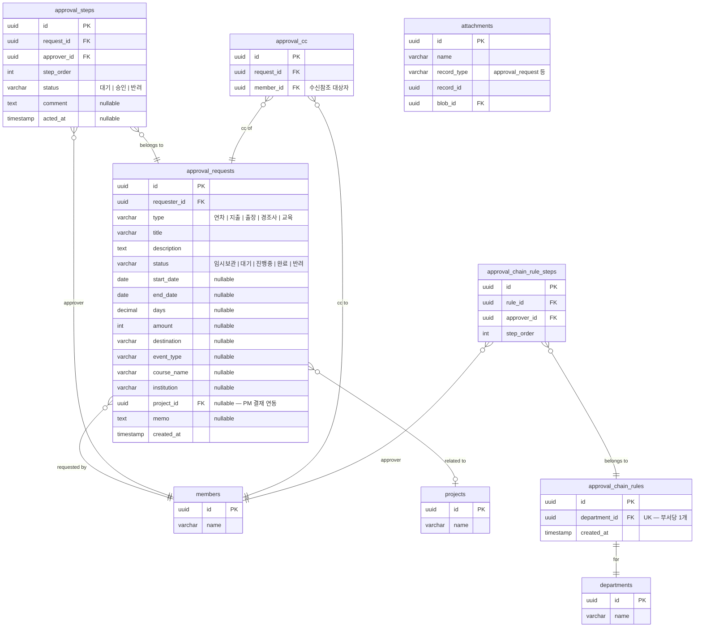

# 결재관리 스키마

```mermaid
erDiagram
    members {
        uuid id PK
        varchar name
    }

    departments {
        uuid id PK
        varchar name
    }

    projects {
        uuid id PK
        varchar name
    }

    approval_requests {
        uuid id PK
        uuid requester_id FK
        varchar type "연차 | 지출 | 출장 | 경조사 | 교육"
        varchar title
        text description
        varchar status "임시보관 | 대기 | 진행중 | 완료 | 반려"
        date start_date "nullable"
        date end_date "nullable"
        decimal days "nullable"
        int amount "nullable"
        varchar destination "nullable"
        varchar event_type "nullable"
        varchar course_name "nullable"
        varchar institution "nullable"
        uuid project_id FK "nullable — PM 결재 연동"
        text memo "nullable"
        timestamp created_at
    }

    approval_steps {
        uuid id PK
        uuid request_id FK
        uuid approver_id FK
        int step_order
        varchar status "대기 | 승인 | 반려"
        text comment "nullable"
        timestamp acted_at "nullable"
    }

    approval_cc {
        uuid id PK
        uuid request_id FK
        uuid member_id FK "수신참조 대상자"
    }

    approval_chain_rules {
        uuid id PK
        uuid department_id FK "UK — 부서당 1개"
        timestamp created_at
    }

    approval_chain_rule_steps {
        uuid id PK
        uuid rule_id FK
        uuid approver_id FK
        int step_order
    }

    attachments {
        uuid id PK
        varchar name
        varchar record_type "approval_request 등"
        uuid record_id
        uuid blob_id FK
    }

    approval_requests }o--|| members : "requested by"
    approval_requests }o--o| projects : "related to"
    approval_steps }o--|| approval_requests : "belongs to"
    approval_steps }o--|| members : "approver"
    approval_cc }o--|| approval_requests : "cc of"
    approval_cc }o--|| members : "cc to"
    approval_chain_rules ||--|| departments : "for"
    approval_chain_rule_steps }o--|| approval_chain_rules : "belongs to"
    approval_chain_rule_steps }o--|| members : "approver"
```
