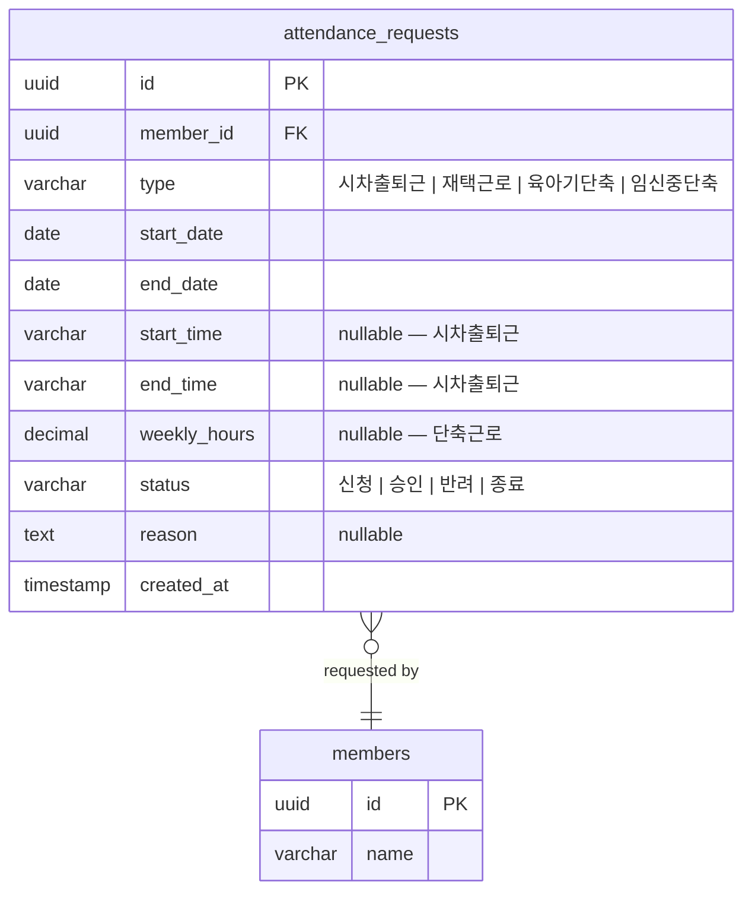

# 근태관리 스키마

```mermaid
erDiagram
    members {
        uuid id PK
        varchar name
    }

    attendance_requests {
        uuid id PK
        uuid member_id FK
        varchar type "시차출퇴근 | 재택근로 | 육아기단축 | 임신중단축"
        date start_date
        date end_date
        varchar start_time "nullable — 시차출퇴근"
        varchar end_time "nullable — 시차출퇴근"
        decimal weekly_hours "nullable — 단축근로"
        varchar status "신청 | 승인 | 반려 | 종료"
        text reason "nullable"
        timestamp created_at
    }

    attendance_requests }o--|| members : "requested by"
```
