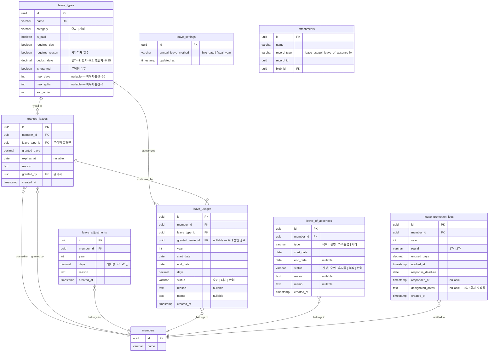

# 연차/휴가 스키마

```mermaid
erDiagram
    members {
        uuid id PK
        varchar name
    }

    leave_types {
        uuid id PK
        varchar name UK
        varchar category "연차 | 기타"
        boolean is_paid
        boolean requires_doc
        boolean requires_reason "사유기재 필수"
        decimal deduct_days "연차=1, 반차=0.5, 반반차=0.25"
        boolean is_granted "부여형 여부"
        int max_days "nullable — 배우자출산=20"
        int max_splits "nullable — 배우자출산=3"
        int sort_order
    }

    granted_leaves {
        uuid id PK
        uuid member_id FK
        uuid leave_type_id FK "부여형 유형만"
        decimal granted_days
        date expires_at "nullable"
        text reason
        uuid granted_by FK "관리자"
        timestamp created_at
    }

    leave_settings {
        uuid id PK
        varchar annual_leave_method "hire_date | fiscal_year"
        timestamp updated_at
    }

    leave_adjustments {
        uuid id PK
        uuid member_id FK
        int year
        decimal days "델타값: +3, -2 등"
        text reason
        timestamp created_at
    }

    leave_usages {
        uuid id PK
        uuid member_id FK
        uuid leave_type_id FK
        uuid granted_leave_id FK "nullable — 부여형인 경우"
        int year
        date start_date
        date end_date
        decimal days
        varchar status "승인 | 대기 | 반려"
        text reason "nullable"
        text memo "nullable"
        timestamp created_at
    }

    leave_of_absences {
        uuid id PK
        uuid member_id FK
        varchar type "육아 | 질병 | 가족돌봄 | 기타"
        date start_date
        date end_date "nullable"
        varchar status "신청 | 승인 | 휴직중 | 복직 | 반려"
        text reason "nullable"
        text memo "nullable"
        timestamp created_at
    }

    leave_promotion_logs {
        uuid id PK
        uuid member_id FK
        int year
        varchar round "1차 | 2차"
        decimal unused_days
        timestamp notified_at
        date response_deadline
        timestamp responded_at "nullable"
        text designated_dates "nullable — 2차: 회사 지정일"
        timestamp created_at
    }

    attachments {
        uuid id PK
        varchar name
        varchar record_type "leave_usage | leave_of_absence 등"
        uuid record_id
        uuid blob_id FK
    }

    leave_types ||--|{ leave_usages : "categorizes"
    leave_types ||--o{ granted_leaves : "typed as"
    granted_leaves }o--|| members : "granted to"
    granted_leaves }o--|| members : "granted by"
    granted_leaves ||--o{ leave_usages : "consumed by"
    leave_adjustments }o--|| members : "belongs to"
    leave_usages }o--|| members : "belongs to"
    leave_of_absences }o--|| members : "belongs to"
    leave_promotion_logs }o--|| members : "notified to"
```
