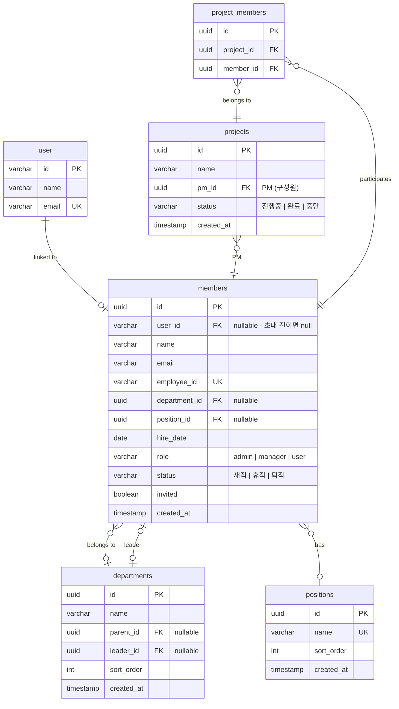

# 조직관리 스키마

```mermaid
erDiagram
    user {
        varchar id PK
        varchar name
        varchar email UK
    }

    members {
        uuid id PK
        varchar user_id FK "nullable - 초대 전이면 null"
        varchar name
        varchar email
        varchar employee_id UK
        uuid department_id FK "nullable"
        uuid position_id FK "nullable"
        date hire_date
        varchar role "admin | manager | user"
        varchar status "재직 | 휴직 | 퇴직"
        boolean invited
        timestamp created_at
    }

    departments {
        uuid id PK
        varchar name
        uuid parent_id FK "nullable"
        uuid leader_id FK "nullable"
        int sort_order
        timestamp created_at
    }

    positions {
        uuid id PK
        varchar name UK
        int sort_order
        timestamp created_at
    }

    projects {
        uuid id PK
        varchar name
        uuid pm_id FK "PM (구성원)"
        varchar status "진행중 | 완료 | 중단"
        timestamp created_at
    }

    project_members {
        uuid id PK
        uuid project_id FK
        uuid member_id FK
    }

    user ||--o| members : "linked to"
    members }o--o| departments : "belongs to"
    members }o--o| positions : "has"
    departments |o--o| members : "leader"
    projects }o--|| members : "PM"
    project_members }o--|| projects : "belongs to"
    project_members }o--|| members : "participates"
```
